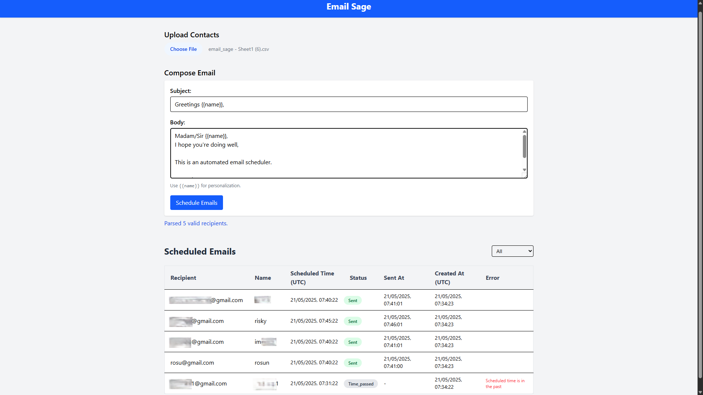

# React + Vite & Node + Express

# Steps to run the application 

1. Clone the repository 
```bash
https://github.com/imrosun/email-sage.git
```

2. To run backend open project and go to terminal 

```bash
cd backend
npm install
npm run start
```

You will need .env file in backend directory which will have 
PORT=5000
MONGO_URI=
SENDGRID_API_KEY=
FROM_EMAIL=

For MONGOURI - Create an account -> create project -> create cluster: copy cluster name
https://account.mongodb.com/account/login

For SENDGRID_API_KEY - Create an account, generate api key, verify email 
https://app.sendgrid.com/

For FROM_EMAIL - verified email address here

Restart the server again

3. To run frontend open new terminal
```bash
cd frontend
npm install
npm run dev
```

You will need .env file in frontend directory too for api endpoint
VITE_API_URLL=http://localhost:5000/api

4. Open app on frontend localhost link or http://localhost:5173/

## SCREENSHOT 

